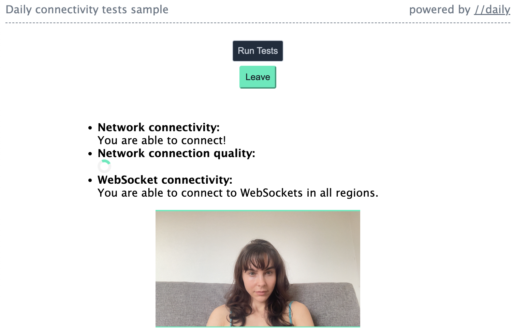

# Connectivity tests sample

This small sample app shows the use of Daily's connectivity test methods:

* [`testConnectionQuality()`](https://docs.daily.co/reference/daily-js/instance-methods/test-connection-quality)
* [`testNetworkConnectivity()`](https://docs.daily.co/reference/daily-js/instance-methods/test-network-connectivity)
* [`testWebsocketConnectivity()`](https://docs.daily.co/reference/daily-js/instance-methods/test-websocket-connectivity)

The above methods enable developers to test a video call participant's network and WebSocket connectivity, and measure their connection quality. 

In this sample, participants do not join a Daily room. Instead, they go through a pre-call flow similar to what one might utilize in a pre-join lobby, except without camera and microphone controls. Their camera is started and the above tests are run, with the result being displayed above their video.



These methods can be used to surface connection and network quality information to the end user or the developer. They can also be used to inform which [send settings](https://docs.daily.co/reference/daily-js/instance-methods/update-send-settings) you choose to enable for the relevant participant, enabling a granular level of quality customization. This is an advanced use case; most implementations can use Daily's defaults, which have been optimized to provide the highest quality configrution for a wide range of calls.

## Running the demo locally

Run the following commands in your terminal:

```bash
git clone git@github.com:daily-demos/daily-samples-js.git
cd daily-samples-js/samples/client-sdk/connectivity-tests
npm i
npm run dev
```

Then, navigate to the port shown in your terminal output. This will likely be `http://localhost:8080`.