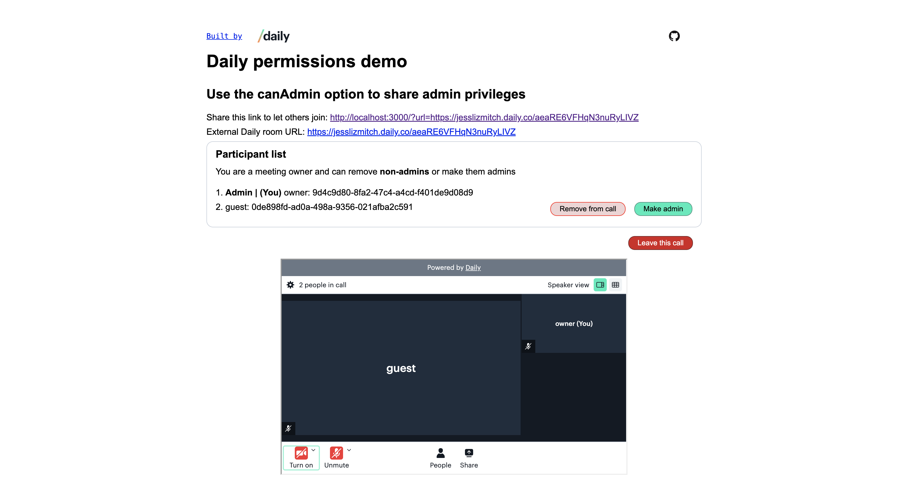
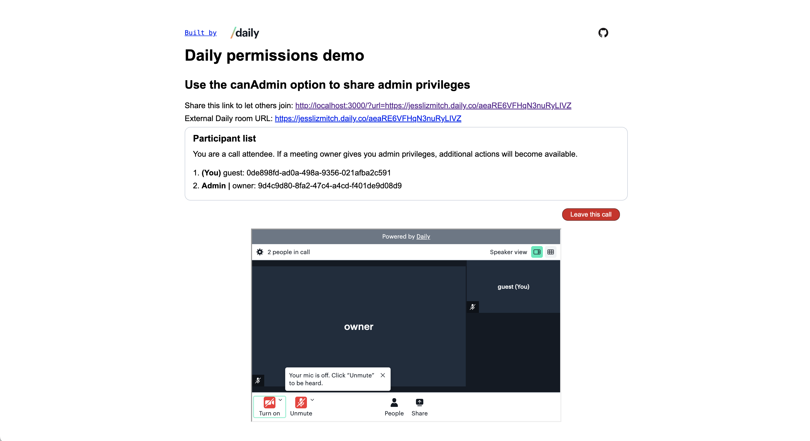
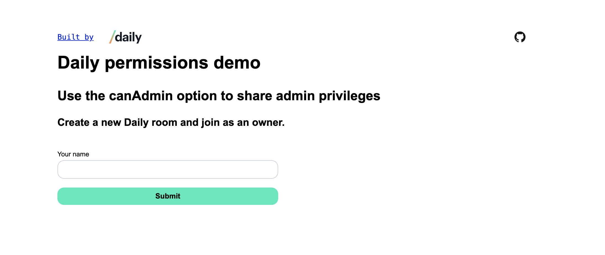

# Daily permissions demo: `canAdmin` (Daily Prebuilt)

This demo app shows how to use the `canAdmin` option to allow an admin to make another participant an admin (i.e., to share their admin privileges).


[`canAdmin`](https://docs.daily.co/reference/daily-js/instance-methods/update-participant#permissions) is an option that can be passed when calling `daily-js`'s [`updateParticipant()`](https://docs.daily.co/reference/daily-js/instance-methods/update-participant) instance method.

With this demo app, admins can click a button next to non-admins' names to make them an admin. Admins can also test their admin privileges by ejecting participants (non-admins) from the call via a button.

Admins _cannot_ eject or remove other admins from the call. Non-admins can see the participant list but do not see the "Make admin" or "Remove from call" buttons.


This app uses [Daily Prebuilt](https://www.daily.co/products/prebuilt-video-call-app/) and [Next.js](https://nextjs.org/).

## Run project locally

### Create a Daily account

To use this app, you will need to create a [Daily account](https://dashboard.daily.co/signup).

### Add environment variables

To add the required environment variables, start by copying the example `.env` file:

```bash
cp .env.example .env
```

In `.env`, add your Daily API key available in the [Daily dashboard](https://dashboard.daily.co/developers) and your Daily domain. (Your Daily domain is the domain in all your Daily room links. E.g., `https://your-domain.daily.co/room-name`.)

```
DAILY_API_KEY=<your-daily-api-key>
NEXT_PUBLIC_DAILY_DOMAIN=<your-daily-domain>
```

### Start dev server

To run this project locally, install project dependencies and run the development server:

```bash
npm install
npm run dev
```

Open [http://localhost:3000](http://localhost:3000) with your browser to see the result.

## Using this demo app

To use this demo app, start by entering your name in the join form.


When you join, a new Daily room and owner meeting token will be created automatically for you. (To see the [Daily REST API](https://docs.daily.co/reference/rest-api) usage in the app, see the files under `/src/pages/api`.)

To let non-admin participants join the call, share the link provided in the app UI.

Once non-admins have joined, use the "Make admin" or "Remove from call" buttons to update the participant's status.

---

(Note: This is a [Next.js](https://nextjs.org/) project bootstrapped with [`create-next-app`](https://github.com/vercel/next.js/tree/canary/packages/create-next-app).)
