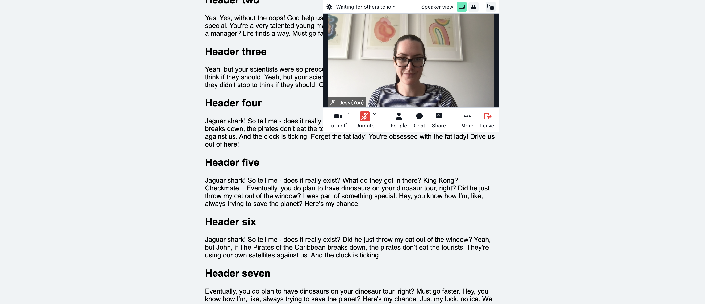
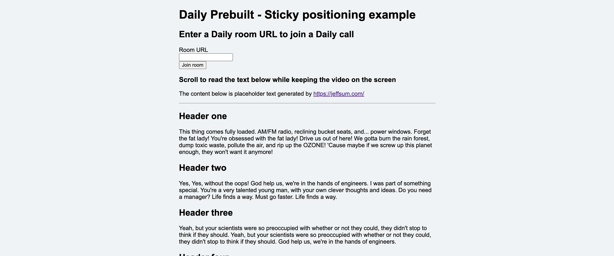
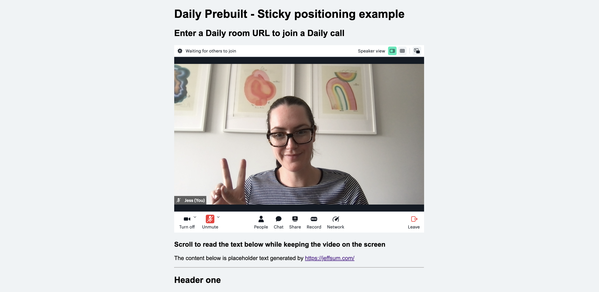

# Daily Prebuilt: Sticky position demo

This demo shows one way to keep your Daily Prebuilt video call on screen even while a user is scrolling through a page. It uses the `display: sticky;` property in the CSS styles to keep the video at the top regardless of where the user is on the page. It also resizes the video on scroll to allow for more text to be visible.



This is a basic demo to show the general idea behind this feature. Use it as inspiration to improve the user experience of your own (hopefully better designed) app. :)

## Run locally

Clone the parent repo ([daily-samples-js](https://github.com/daily-demos/daily-samples-js)) and then open the `index.html` file in the browser. To open it, you can drag `index.html` from your editor to the browser or use the third command below.

```bash
git clone https://github.com/daily-demos/daily-samples-js.git
cd daily-samples-js/samples/daily-prebuilt/sticky-positioning/
open ./index.html
```

## How to use the demo

### Create a Daily room

To use this demo, you will need a public Daily room to join.

To get a Daily room URL, [create a Daily account](https://dashboard.daily.co/signup).

Once you have an account and are logged into the [Daily dashboard](https://dashboard.daily.co/), you can [create a new Daily room](https://dashboard.daily.co/rooms/create).

Copy the new room's URL. You can use this in the form on the home page.

The room URL will be in the following format:

`https://<your-daily-domain>.daily.co/<room-name>`

**Note**: Because this is a "bare-bones" demo, error handling has not been added if your Daily room is private or the URL is invalid/not formatted correctly. Keep your browser console open to see errors if you are having any issues!

### Join your Daily call

Once you have a Daily room and have the demo open in your browser of choice, enter the Daily room URL into the form.


Join the room and scroll to see how the video "sticks" to the top. This is due to the `display: sticky;` setting in the CSS styles.




